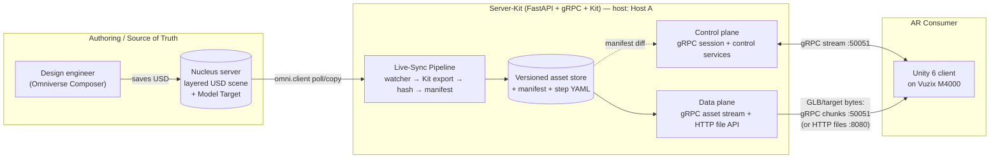
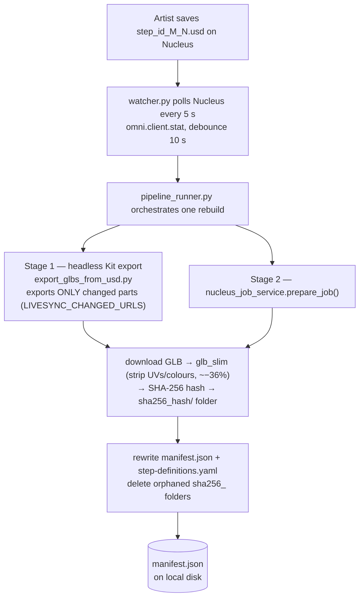
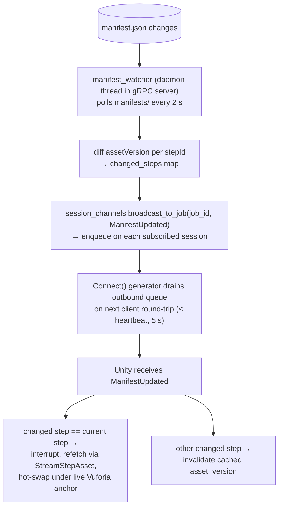
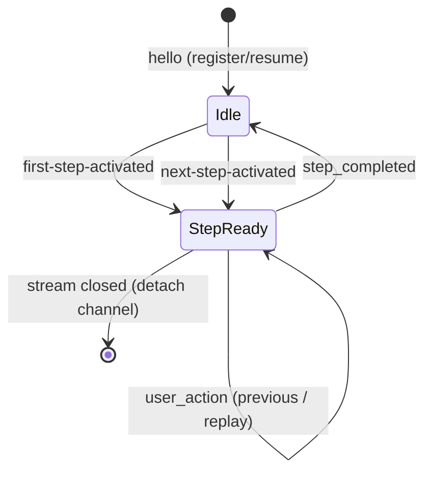
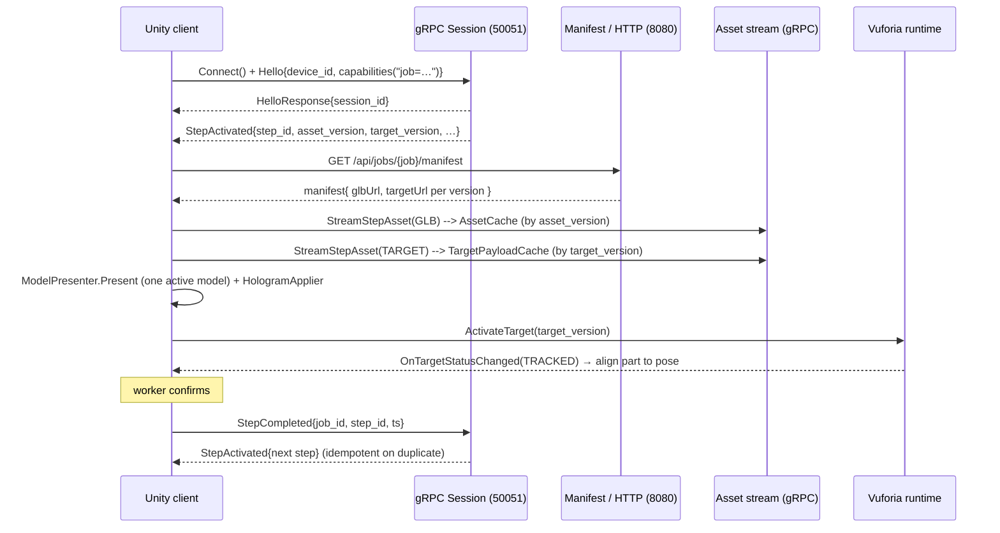

# System Architecture — Omniverse → Unity AR Worker Guidance

*A Digital-Twin architecture for step-driven augmented-reality assembly guidance.*

Status: living document · Scope: whole system · Audience: architects, engineers, reviewers

---

## 0. How to read this document

This document describes the system on two registers at once:

- **Scientifically** — as a layered distributed system with a defined *source of
  truth*, a *control plane*, a *data plane*, and a set of formally stated
  invariants (determinism, idempotency, immutability) that make the system's
  behaviour reproducible and analysable.
- **As an engineering reference** — with concrete components, file paths, ports,
  message contracts, and sequence walkthroughs a developer can act on.

Where a claim is architectural, it is stated as a **property** or **invariant**.
Where a claim is implementation, it points at the **file** that realises it.

---

## 1. Problem statement and thesis

### 1.1 The engineering problem

A worker wearing smart glasses (Vuzix M4000) on an assembly line must be shown,
in situ and hands-free, *exactly one* part at a time: where it goes, how it moves
into place, and when to confirm it. The 3D content, its animation, and the
spatial anchor that aligns it to the physical workstation all originate from an
engineering authoring tool (NVIDIA Omniverse) and must reach the device *without
the device carrying any assembly-specific content in its app bundle*, and ideally
*without human intervention when the source design changes*.

### 1.2 The scientific framing: a Digital Twin loop

The system is an instance of the **Digital Twin** pattern specialised to
assembly instructions. There is a single **source of truth** — the layered
OpenUSD scene on an Omniverse **Nucleus** server — and a **consumer** — the Unity
runtime on the glasses. The architecture's central claim is:

> **Thesis.** *A change to the authoritative USD scene propagates deterministically
> and automatically to the AR consumer, such that "saving in Omniverse updates the
> worker's view within ~60 s," while the consumer remains a stateless, content-free
> renderer whose only inputs are an immutable, content-addressed asset stream and a
> small deterministic control channel.*

Everything below exists to make that sentence true and verifiable.

---

## 2. Architectural style and rationale

The system deliberately separates two channels with different physics:

| Channel | Carries | Transport | Size | Semantics |
|--------|---------|-----------|------|-----------|
| **Control plane** | Session lifecycle, step activation, confirmations, live-sync notifications | gRPC bidirectional stream (HTTP/2), REST fallback | Small, frequent | Deterministic, idempotent, ordered per session |
| **Data plane** | GLB geometry+animation, Vuforia Model Target databases | gRPC server-streaming (chunked) + HTTP file serving | Large, occasional | Immutable, content-addressed, cacheable |

This **control/data-plane split** is the primary architectural decision. It lets
the control channel stay small and analysable (a state machine over a handful of
message types) while large binary payloads travel on a channel optimised for
throughput and caching. The two planes meet only through an **immutable version
identifier** (`asset_version = sha256(content)[:16]`): the control plane *names* a
version, the data plane *serves* that version, and the client *caches by* that
version.

### 2.1 Design principles (and where they are enforced)

1. **Single source of truth.** Omniverse/Nucleus owns geometry, animation, and
   layer semantics. The server derives; it never authors. The client renders; it
   never stores.
2. **Zero embedded assembly data on the client.** No `.glb`, `.dat`, `.xml`, or
   `.manifest.json` ships in the app. Enforced as a *build gate* by
   `Assets/App/Editor/NoEmbeddedAssemblyDataCheck.cs` — the Unity build fails if
   any such file is found under `Assets/`.
3. **Determinism.** Given the same USD inputs, the resolver produces the same
   `ResolvedStep` and the same cache key on every run
   (`layer_stack_resolver.py`). Steps are totally ordered by
   `(sequence_index, numeric step_id, step_id)`.
4. **Immutability + content addressing.** Asset versions are SHA-256 hashes of
   the *bytes actually served* (hashing happens *after* mesh slimming, so the
   version reflects the delivered payload). Identical content ⇒ identical
   version ⇒ no re-transfer, no re-render. Self-deduplicating.
5. **Idempotency.** Duplicate `StepCompleted` / `Heartbeat` messages are absorbed
   (`processed_step_completions` set, keyed by `(job_id, step_id, ts)`). Reconnect
   restores the last known job and step rather than resetting.
6. **One active model.** At any instant the client holds exactly one GLB instance
   under one root transform; presenting a new step disposes the previous one.
   Bounds memory and thermal load on the wearable.

---

## 3. System context (C4 level 1)



**Actors and systems**

- **Design engineer** — authors the assembly in Omniverse; the only human in the
  loop, and only at authoring time.
- **Nucleus** — Omniverse's collaboration/version server; holds the authoritative
  layered USD and the Vuforia Model Target. Accessed via `omni.client`.
- **Server-Kit** — a Python service bundle that (a) runs the live-sync build
  pipeline against Nucleus, and (b) serves the control and data planes to the
  device. Currently co-located on host **Host A**, but the design permits splitting
  (only Nucleus reachability + a shared manifest location are required).
- **Unity 6 client** — the AR runtime on the glasses; stateless w.r.t. assembly
  content, aligns content to the physical world via Vuforia Model Targets.

---

## 4. The domain model

### 4.1 Source scene: layered USD

The authoritative scene is an **OpenUSD stage** composed of sublayers:

- **Base geometry layer** — the complete, authoritative hierarchical product
  geometry (immutable reference geometry).
- **Animation layers** — time-sampled transforms that move a part from a start
  offset into place.
- **Target-position (end-position) layers** — the part statically at its final
  pose `(0,0,0)`.

Each assembly **part** is represented by a **layer pair**: `(animation layer,
target-position layer)`. The USD timeline runs over integer time steps (example
profile: `1–101` at `30 FPS`); each part's animation occupies a window (e.g.
`1–10`, `11–30`, …) and then remains statically visible to the end of the
timeline.

### 4.2 The BTU layer-handover convention

Runtime progression follows a **layer-muteness handover** modelled on the
`btu.switch_step_layers_ui` convention (see `layer_stack_resolver.py`):

- Layers, ordered bottom-to-top, alternate roles: **even indices** are animation
  layers, **odd indices** are end-position layers.
- **On completion of step N:** unmute the end-position layers of all completed
  steps `1..N`, and unmute the animation layer of step `N+1`. Everything else is
  muted.

Formally, the visible set after completing step *N* is:

```
visible(N) = { target_layer(k) : 1 ≤ k ≤ N } ∪ { animation_layer(N+1) }
muted(N)   = all_layers \ visible(N)
```

This yields the operator experience: previously placed parts stay fixed at their
final pose, and the *next* part is shown animating into place — one active
animation at a time.

### 4.3 Canonical internal form: `ResolvedStep`

The resolver projects `(step definition × layer stack)` into a deterministic,
immutable `ResolvedStep` record (`layer_stack_resolver.py`, `@dataclass(frozen=True)`)
carrying, among others: `active_prim_path`, `animation_name`, the animation window
`[animation_start_step, animation_end_step]`, `keep_visible_until_step`, the
`handover_target_layer_id` and `handover_next_animation_layer_id`, the computed
`visible_layer_ids` / `muted_layer_ids`, and a **`cache_key`**.

**Determinism property.** `cache_key = sha256(canonical_json(inputs))` over a
sorted-key JSON serialisation of all resolver inputs (`_compute_cache_key`). The
same inputs always yield the same key; any change to source layers, windows, or
part identity changes the key. This makes cache invalidation exact and
reproducible.

### 4.4 Step definition schema

Steps are declared in `shared/samples/step-definitions.yaml`
(`StepDefinitionRepository`), the canonical business-level source that maps steps
to USD composition inputs. The per-step delivery contract exposed to the client
(`StepActivated`) carries: `job_id`, `step_id`, `part_id`, `display_name`,
`instructions_short`, `safety_notes[]`, `asset_version`, `target_id`,
`target_version`, `anchor_type`, `animation_name`, `prefetch_next_step_id`.

---

## 5. The two-halves pipeline (Digital-Twin loop)

The system splits into two largely independent halves joined by **one shared
file**: `shared/samples/manifests/<job_id>.manifest.json`. This file is the
**contract boundary** between authoring and delivery.

### 5.1 Omniverse half — deriving delivery artifacts from USD



Key mechanisms and their rationale:

- **Watcher lives *outside* Kit** so the sync loop runs whether or not an
  interactive Kit session is open; the artist controls Kit independently.
- **Debounce** coalesces the burst of intermediate saves during active editing
  into one rebuild.
- **Incremental rebuild.** The changed source URLs are passed to the headless Kit
  export via `LIVESYNC_CHANGED_URLS`; only those parts are re-exported. (Added
  after single-part edits showed ~80 % of rebuild time was spent re-doing
  unchanged parts.)
- **Slim-before-hash.** `glb_slim` strips unused vertex attributes *before*
  hashing so `asset_version` reflects the exact bytes served (~−36 %).
- **Content-hashed versions** give automatic deduplication and orphan cleanup
  keeps disk bounded.
- **Force-exit (`os._exit`)** terminates the headless Kit subprocess reliably
  (a clean `post_quit()` did not always stop background services).

### 5.2 Delivery half — pushing change to the device



- `ManifestUpdated { job_id, new_workflow_version, changed_steps: map<stepId, assetVersion> }`
  carries **only** the steps whose content actually changed; an empty map (a no-op
  save) is correctly silent.
- **Push mechanics.** The server has no independent push socket to the client; it
  piggybacks on the existing duplex stream. `SessionChannels` holds a per-session
  outbound `queue.Queue`; the `Connect()` generator drains it at the end of every
  iteration, so a push is delivered no later than one client message round-trip
  after it is queued (`grpc_session_service.py`, lines ~219–228).
- **Latency budget.** End-to-end ~55–60 s for a single-part edit, dominated by
  Kit boot (~9 s) and the 10 s debounce; the Unity hot-swap itself is ~5 s.

> **Implementation status.** Server halves (change detection → manifest → push)
> are complete and testable. The Unity-side receipt of `ManifestUpdated` and
> hot-swap (delivery steps 9–11) are the planned next client work — see
> `docs/live-sync/architecture.md` §6.

---

## 6. Component reference (C4 level 3)

### 6.1 Server-Kit (Python)

Composition root: `server_kit_main.py :: create_app()` wires every service from
`AppConfig.from_env()` and mounts the FastAPI routers. Ports default to gRPC
**50051** and HTTP **8080** (`config.py`, `guidance_server.py::ServerConfig`).

| Layer | Component | File | Responsibility |
|------|-----------|------|----------------|
| Source access | `nucleus_job_service` | `omniverse/nucleus_job_service.py` | Download GLBs + Model Target from Nucleus, slim, hash, write manifest + YAML (pipeline stage 2) |
| Source access | `export_glbs_from_usd` | `omniverse/export_glbs_from_usd.py` | Headless Kit GLB export of changed parts (pipeline stage 1) |
| Source access | `omniverse/router`, `service`, `stage_service` | `omniverse/` | `/omni` HTTP endpoints; optional (loaded only if `omni.client` is importable) |
| Resolver | `StepDefinitionRepository` | `step_definition_repository.py` | Reads `step-definitions.yaml` |
| Resolver | `LayerStackResolver` | `layer_stack_resolver.py` | BTU layer-pair muteness projection → deterministic `ResolvedStep` + cache key |
| Control plane | `GuidanceSessionService` | `grpc_session_service.py` | Duplex `Connect` stream: hello → step-activated; heartbeat; step-completed → next; user_action (previous/replay); fault |
| Control plane | `GuidanceControlService` | `grpc_control_service.py` | External `ControlStep` (GOTO/NEXT/PREVIOUS) — lets a dashboard/MES drive a device's step |
| Control plane | `SessionManager` / `SessionState` | `guidance_server.py` | Session register/resume, state transitions, JSON persistence |
| Control plane | `SessionChannels` | `session_channels.py` | Per-session outbound push queues for live-sync |
| Control plane | `manifest_watcher` | `manifest_watcher.py` | Daemon thread: diff manifest, broadcast `ManifestUpdated` |
| Data plane | `AssetTransferService` | `grpc_asset_service.py` | `StreamStepAsset`: chunked GLB / Vuforia target streaming |
| Data plane | HTTP file API | `server_kit_main.py` | `/api/jobs/{id}/manifest`, `/api/assets/{ver}/{file}`, `/api/targets/{ver}/{file}` |
| Data plane | `ManifestService` | `manifest_service.py` | Parse `{job_id}.manifest.json`; build client URLs |
| Export | `StepPackageExporter` / `ExportJobService` | `export_pipeline.py`, `export_job_service.py` | Reproducible package build; queue/worker mode; cancel/cleanup |
| Codec | `DracoCodec` | `draco_codec.py` | Optional Draco mesh compression, negotiated per side |
| Discovery | `discovery_beacon`, `connection_qr` | `discovery_beacon.py`, `connection_qr.py` | UDP LAN beacon + QR page so the device can find the server |

### 6.2 Unity 6 client (C#)

Composition root: `AppRuntimeContext` creates and wires runtime services;
`AppBootstrap` drives the lifecycle.

| Layer | Component | File | Responsibility |
|------|-----------|------|----------------|
| Orchestration | `AppBootstrap` | `Runtime/AppBootstrap.cs` | Session lifecycle; resolve → present loop |
| Orchestration | `StepCoordinator` | `StateMachine/StepCoordinator.cs` | Client step state machine (Idle → Tracking → Confirmed) |
| Control transport | `SessionClient` | `Networking/SessionClient.cs` | Wrapper over `ISessionTransport`; fires `StepActivated` |
| Control transport | `GrpcSessionTransport` | `Networking/GrpcSessionTransport.cs` | Native gRPC duplex stream (default) |
| Control transport | `HttpBridgeSessionTransport` | `Networking/HttpBridgeSessionTransport.cs` | REST fallback |
| Data transport | `GrpcAssetTransferClient` | `Networking/GrpcAssetTransferClient.cs` | Streams GLB / target via `AssetTransferService` |
| Data transport | `StepAssetManifestClient` | `Gltf/StepAssetManifestClient.cs` | HTTP GET manifest |
| Cache | `AssetCache`, `TargetPayloadCache` | `Caching/` | Immutable-by-version disk caches under `persistentDataPath` |
| Presentation | `ModelPresenter` + `GltfFastModelLoader` | `Gltf/` | One active GLB via glTFast; primitive fallback |
| Presentation | `HologramApplier`, `FixtureOverlay` | `Runtime/` | Hologram skin; slice-plane reveal on first track |
| Tracking | `TargetManager`, `VuforiaTrackingBridge`, `VuforiaModelTargetLoader` | `Vuforia/` | Model Target activation + smoothed pose alignment |
| Telemetry | `TelemetryClient` | `Telemetry/` | Fault/event tracking |

**Android transport note.** On Vuzix M4000 (ARM64, IL2CPP) the pure-managed
`Grpc.Net.Client` runs over `YetAnotherHttpHandler` (Rust HTTP/2), because Unity's
Mono runtime does not expose `SocketsHttpHandler`. The deprecated `Grpc.Core`
C-core is not used.

---

## 7. Interface contracts (proto)

Canonical contract: `proto/guidance.proto` (`package guidance.v1`). Four services:

```proto
service GuidanceSessionService { rpc Connect(stream ClientMessage) returns (stream ServerMessage); }
service AssetQueryService       { rpc GetManifest(ManifestRequest) returns (AssetManifest); }
service AssetTransferService    { rpc StreamStepAsset(StepAssetStreamRequest) returns (stream StepAssetChunk); }
service GuidanceControlService  { rpc ControlStep(ControlStepRequest) returns (ControlStepResponse); }
```

**Envelope oneofs** (the control-plane message alphabet):

- `ClientMessage` → `hello | heartbeat | tracking_state | user_action | step_completed | fault`
- `ServerMessage` → `hello_response | assign_job | step_activated | cancel_step | ping | fault | manifest_updated`

The `oneof` envelope makes the protocol *extensible under a closed set*: adding a
message type is a compatible change; the receiver dispatches on
`WhichOneof("payload")`. Data-plane chunking (`StepAssetChunk`) carries
`chunk_index`, `is_last`, `applied_compression`, and the `asset_version` it
belongs to, so the client can verify and cache by version as it assembles chunks.

---

## 8. Behavioural model

### 8.1 Server session state machine

`SessionState` (`guidance_server.py`) is intentionally small: `Connected`, `Idle`,
`StepReady`. Transitions are logged with `(previous → next, reason)` for
observability.



### 8.2 Step-activation sequence (happy path)



### 8.3 External control (dashboard / MES)

`GuidanceControlService.ControlStep` lets a system that is *not* the device's
session client jump a connected device to a step (`GOTO`), returning
`sessions_notified`. The server resolves the target step and pushes
`StepActivated` to the matching session(s) through their existing `Connect`
stream via `SessionChannels` — the same push substrate live-sync uses.

---

## 9. Data transfer — who moves what

A recurring question is *which mechanism actually carries each piece of data to
the device*. The framing "FastAPI vs HTTP vs gRPC" contains a category error
worth resolving first.

### 9.1 FastAPI *is* HTTP — it is not a third transport

FastAPI is not a transport. It is a Python web **framework** running under uvicorn
(an ASGI HTTP server). "Served by FastAPI" means "served **over HTTP**." So the
system has exactly **two transports**, running as **two separate server
processes** on two ports:

| Transport | Spoken by | Port | Started by |
|-----------|-----------|------|-----------|
| **HTTP** | FastAPI / uvicorn | **8080** | `uvicorn server_kit_main:app --port 8080` |
| **gRPC** (over HTTP/2) | standalone gRPC server | **50051** | `python server-kit/app/grpc_server_main.py` |

gRPC does **not** run through FastAPI. They are independent listeners; the client
holds connections to both.

### 9.2 The per-payload mapping

| What moves | Transport | Port | Server component | Client component |
|-----------|-----------|------|------------------|------------------|
| **Which step/version to load** (`StepActivated`) | **gRPC** stream | 50051 | `GuidanceSessionService.Connect` | `GrpcSessionTransport` |
| **Manifest** (small JSON: version → filename) | **HTTP** GET | 8080 | FastAPI `GET /api/jobs/{id}/manifest` | `StepAssetManifestClient` |
| **GLB bytes** (geometry + animation) | **gRPC** server-stream | 50051 | `AssetTransferService.StreamStepAsset` | `GrpcAssetTransferClient` |
| **Vuforia target bytes** (`.dat`/`.xml`) | **gRPC** server-stream | 50051 | `AssetTransferService.StreamStepAsset` | `GrpcAssetTransferClient` |

**The essential point:** the heavy binary payloads (GLB, Vuforia target) are
**transferred by gRPC**, *not* by FastAPI. FastAPI's role in the runtime path is
to serve the small **manifest** — the lookup table mapping each `asset_version` to
its concrete file name. The control channel *names* a version, the manifest
*resolves* it to a file, and gRPC *streams* the bytes of that file.

### 9.3 How gRPC streams a file — chunked server-streaming

gRPC does not send a file as one blob. `AssetTransferService.StreamStepAsset`
(`grpc_asset_service.py`) is a **server-streaming** RPC: the server opens the file
and *yields* it as an ordered sequence of `StepAssetChunk` protobuf messages of
**64 KB** each.

```python
# grpc_asset_service.py — the core streaming loop (chunk_size = 64 * 1024)
with stream_path.open("rb") as handle:
    chunk_index = 0
    while True:
        data = handle.read(self._chunk_size)      # 64 KB
        if not data:
            break
        is_last = handle.tell() >= total_size
        yield guidance_pb2.StepAssetChunk(
            job_id=..., step_id=...,
            asset_version=asset_version,           # which version these bytes are
            file_name=file_name,
            applied_compression=applied_compression,
            chunk_index=chunk_index,               # ordering key
            data=data,                             # the raw bytes
            is_last=is_last,                        # end-of-stream marker
        )
        chunk_index += 1
```

A 2 MB GLB therefore becomes ~32 sequential `StepAssetChunk` messages. gRPC's
HTTP/2 framing carries them in order; `GrpcAssetTransferClient` reassembles the
`data` fields by `chunk_index` until `is_last == true`, associates the result with
`asset_version`, and writes the finished file into `AssetCache` (GLB) or
`TargetPayloadCache` (target) under `Application.persistentDataPath`.

### 9.4 Full transfer sequence for one step

```
1. gRPC  :50051   Server → Unity   StepActivated { asset_version, target_version, … }
                                    "load version sha256_a1b2c3"
2. HTTP  :8080    Unity  → Server   GET /api/jobs/{job}/manifest
                  Server → Unity   { steps:[ {assetVersion, glbFile, targetFile…} ] }
                                    — lookup table only, no heavy bytes
3. gRPC  :50051   Unity  → Server   StreamStepAsset(GLB)
                  Server → Unity   StepAssetChunk × N  (64 KB) ──► AssetCache
4. gRPC  :50051   Unity  → Server   StreamStepAsset(VUFORIA_TARGET)
                  Server → Unity   StepAssetChunk × N           ──► TargetPayloadCache
```

### 9.5 The HTTP alternative for bulk bytes

FastAPI **also** exposes `GET /api/assets/{version}/{file}` and
`GET /api/targets/{version}/{file}`, which return the same bytes as a plain HTTP
`FileResponse` with `Cache-Control: public, immutable, max-age=31536000`. So the
GLB and target *can* be delivered over HTTP as well — and the manifest's URLs
point at these endpoints for non-gRPC access. In the **current runtime path Unity
uses gRPC streaming**; the HTTP asset/target endpoints are the alternative /
fallback delivery route.

**Why the split.** Small, decision-carrying data (control messages, manifest) fit
a cheap request/response shape. Large binary payloads use gRPC **server-streaming
in 64 KB chunks** so the device never buffers a whole file in one message,
transfer is naturally backpressured over HTTP/2, and it reuses the same connection
already open for the session.

---

## 10. Non-functional properties and how they are achieved

| Property | Mechanism | Where |
|---------|-----------|-------|
| **Determinism** | Total step ordering; canonical-JSON SHA-256 cache key | `layer_stack_resolver.py`, `_sorted_steps` |
| **Idempotency** | Dedup sets keyed by `(job, step, ts)`; register-or-resume | `grpc_session_service.py`, `SessionManager` |
| **Immutability / caching** | Content-addressed `asset_version`; `Cache-Control: immutable` on `/api/assets` and `/api/targets` | `server_kit_main.py`, manifest |
| **Bounded device memory/thermals** | One active model; dispose-before-present; one active target | `ModelPresenter`, Plan M8/M10 |
| **Resilience to network loss** | Periodic heartbeat + reconnect; frozen-step with cached asset; session resume | `AppBootstrap`, `SessionManager` |
| **Bandwidth economy** | Slim-before-hash; content dedup; optional Draco; incremental rebuild | `glb_slim.py`, `draco_codec.py`, live-sync |
| **Observability** | Structured JSON logs with fixed fields (`timestamp, level, event, message, session_id, step_id, correlation_id`); diagnostics bundle | `logging_config.py` |
| **Deployability without embedded data** | Editor build gate rejects embedded assembly files | `NoEmbeddedAssemblyDataCheck.cs` |
| **Zero-config LAN discovery** | UDP beacon + QR-code endpoint advertising | `discovery_beacon.py`, `connection_qr.py` |

---

## 11. Deployment and topology

- **Current deployment:** both pipeline half and delivery half run on host
  **Host A**, sharing the manifest via local disk. Nucleus runs as the Omniverse
  collaboration server.
- **Ports:** gRPC `50051` (session, asset transfer, control); HTTP `8080`
  (manifest, assets, targets, connection/QR, bridge). UDP `45454` discovery beacon.
- **Transport selection:** Unity defaults to **native gRPC** (`AppBootstrap
  useNativeGrpcTransport = true`); the **HTTP bridge** (`/unity/connect`,
  `/unity/heartbeat`, `/unity/step-completed`) is a fallback for runtime profiles
  where native gRPC is unavailable. An Envoy gRPC-Web gateway exists only for
  explicit experiments (see ADR-0003/0004/0005).
- **Split-host readiness:** the two halves may be separated with no code change —
  they require only Nucleus reachability and a shared manifest location.
- **Alternate control server:** an ASP.NET **test server** (port 5000) implements
  the same proto contract with a web admin UI, and can stand in for the Python
  control plane during authoring/testing.

---

## 12. Key architectural decisions (ADRs)

Recorded under `docs/decisions/`:

- **ADR-0001** — proto step source, logging, and loader conventions.
- **ADR-0002** — HTTP export processing ownership + lifespan (inline vs.
  enqueue-only worker).
- **ADR-0003** — Unity/Android transport via Envoy gRPC-Web (experiment).
- **ADR-0004** — Unity direct HTTP bridge as a fallback default.
- **ADR-0005** — Unity **native gRPC, no proxy**, as the production default.

Other applied decisions: content-hash (not version-number) asset identity; GLB as
the runtime geometry+animation format; gRPC streaming for control, HTTP for bulk
data; Vuforia **Model Targets** for real-geometry alignment; structured logs with
per-session/per-step correlation IDs.

---

## 13. Traceability: architecture ↔ code

| Architectural element | Primary source |
|---|---|
| Control/data-plane services | `proto/guidance.proto` |
| Composition root (server) | `server-kit/app/server_kit_main.py` |
| Session control plane | `server-kit/app/grpc_session_service.py` |
| External control | `server-kit/app/grpc_control_service.py` |
| Live-sync push substrate | `server-kit/app/session_channels.py`, `manifest_watcher.py` |
| Deterministic resolver | `server-kit/app/layer_stack_resolver.py` |
| Nucleus → manifest pipeline | `server-kit/app/omniverse/nucleus_job_service.py`, `export_glbs_from_usd.py` |
| Data plane (assets) | `server-kit/app/grpc_asset_service.py`, `manifest_service.py` |
| Client composition + loop | `client-unity/Assets/App/Runtime/AppBootstrap.cs` |
| Live-sync narrative | `docs/live-sync/architecture.md` |
| Component-level architecture | `docs/architecture.md` |

---

*This document is intended to be read alongside `docs/architecture.md` (component
map + runtime data flow) and `docs/live-sync/` (per-file live-sync reference).
Where they disagree, the code in the traceability table is authoritative.*
